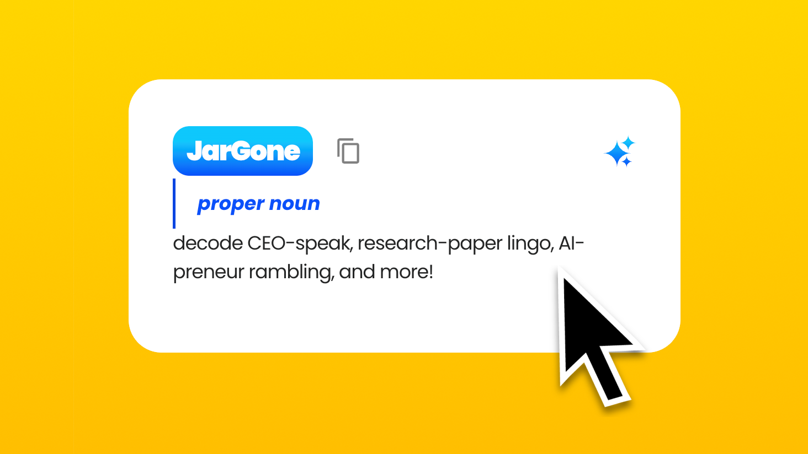

# JarGone - AI-Powered Text Simplification Extension

<h3 align="center">Simplify complex jargon by translating it into clear, accessible language with a single click!</h3>

    <a href="https://youtu.be/-e5QRBsvcAk">Demo</a>
    ·  
    <a href="https://github.com/OveringOwl/jargone-integrated-ai/releases">Download</a>

<h3 align="center"></h3>

## Overview

JarGone is an AI-powered browser extension designed to simplify complex jargon and technical language by providing clear, accessible alternatives with a single click. This extension aims to improve accessibility for both non-native speakers and regular users who find web content filled with difficult and complex terminology, enhancing their understanding while promoting learning.

With JarGone, users can access and comprehend complex information more easily, whether it's in articles, academic texts, or any website with dense language. The extension offers a seamless and interactive way to break down barriers created by technical jargon and sophisticated words, making web content more approachable and inclusive for everyone.

### Problem Being Solved

*Have you ever seen how CEOs speak on LinkedIn?* 

The web is filled with complex and inaccessible jargon that can be intimidating or confusing for a wide variety of users, from non-native speakers to those unfamiliar with certain fields or industries. This often leads to misunderstanding, missed opportunities for learning, and unnecessary frustration. JarGone addresses this issue by offering a simple way to clarify challenging text, allowing users to both understand and learn from what they read.

Key problems JarGone solves include:

- **Difficulty in understanding complex jargon**: Users often struggle with reading comprehension when faced with technical or academic vocabulary.
- **Accessibility for non-native speakers**: Words and phrases that may seem simple to native speakers can be a major hurdle for those who speak a different language.
- **Lack of tools to learn vocabulary contextually**: JarGone helps users expand their vocabulary by offering clear explanations and contextual meanings.
- **Intuitive and customizable user experience**: With various settings like language selection and text replacement options, users can tailor the experience to their liking.

## Features

- **AI-powered text simplification**: With just a click, users can replace complex text with simpler, more understandable versions.
- **Contextual word breakdown**: For those who choose not to replace the text, the extension offers contextual tooltips that explain the meaning of difficult words or phrases.
- **Keyword extraction**: The extension extracts key terms and provides their grammatical type and meaning.
- **Multilingual support**: Users can select their preferred language, and the simplified text and word meanings will appear in that language.
- **Customizable settings**: Users can choose to enable or disable confetti animations upon success, enable or disable text replacement, and change the language for the simplified text.

## Technologies Used

This extension was made possible thanks to:

- **[Gemini Nano on Google Chrome](https://developer.chrome.com/docs/ai/built-in)**: This experimental AI model enables JarGone to process and understand the selected text to generate simplified versions and breakdowns of complex words. The AI is leveraged through the **Prompt API**.
- **[React](https://react.dev/) & [Material UI](https://mui.com/)**: For building an interactive and user-friendly frontend, enabling smooth UI transitions and customizable options.
- **[WXT](https://wxt.dev/)**: A framework that offers amazing DX and bundles the necessary extension files together for smooth development, distribution and installation.
- **[pnpm](https://pnpm.io/)**: A performant and efficient package manager for node.
- and countless other open-source dependencies!

## Installation

To install and use the JarGone browser extension:

1. Clone the repository.
2. Ensure you have [pnpm](https://pnpm.io/) installed.
3. Run `pnpm i` at project root.
4. Run `pnpm run dev` or one of the many scripts available in `package.json`.

## Usage

- **Simplify Text**: Highlight any chunk of text on a webpage, right-click to open the context menu, and select "Simplify with JarGone". The text will be replaced with a simpler version.
- **Tooltip Mode**: If you prefer not to replace the text, simply select the text, and tooltips will appear when you hover over difficult words, providing contextual definitions.
- **Language Selection**: Open the extension’s settings to select your preferred language. The AI will then display simplified text and explanations in the chosen language.
- **Customization**: The extension provides settings like enabling confetti animations or toggling whether the text should be replaced or not.

## Contributing

If you would like to contribute to JarGone, please follow these steps:

1. Fork the repository.
2. Create a new branch (`git checkout -b feature-branch`).
3. Make your changes and commit them (`git commit -am 'Add new feature'`).
4. Push to the branch (`git push origin feature-branch`).
5. Open a pull request to the main repository.

## License

This project is open-source and available under the GPL License. See the [LICENSE](LICENSE) file for more information.

## Acknowledgements

- **[Gemini Nano on Google Chrome](https://developer.chrome.com/docs/ai/built-in)**: For providing the AI model used to simplify and explain complex text.
- **[React](https://react.dev/) & [Material UI](https://mui.com/)**: For the powerful tools used to create the frontend user interface.
- **[WXT](https://wxt.dev/)**: For helping bundle the extension files efficiently. 
- **[pnpm](https://pnpm.io/)**: For helping keep the package size minimal.
- and the countless other open-source dependencies.

## Contact

For any inquiries or feedback, feel free to contact us via the issues section of the repository or email at overingowl+jargone+support@gmail.com.
